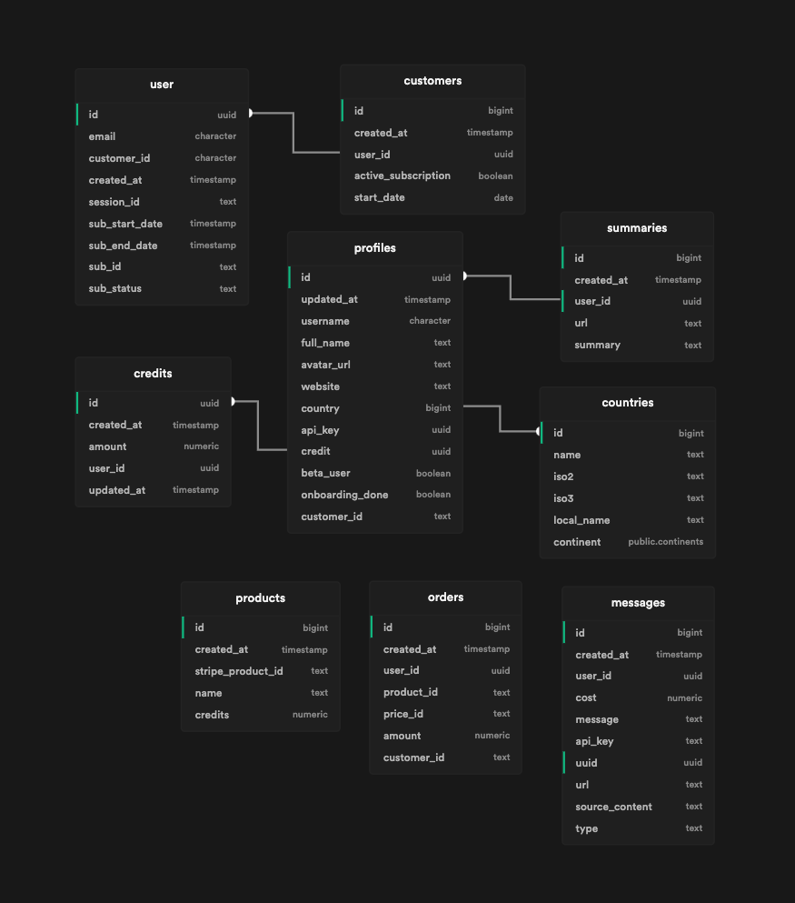

# GeneratorXYZ

This is the frontend application of [GeneratorXYZ](https://generatorxyz.com) which is a platform for generating content with AI. Like social media messages, summaries and SEO improvers.

> **Why make it opensource?** 
I decided to make the frontend application opensource so more people can use it to build their own platform. You can clone this repo and use it how you like. Using the GeneratorXYZ logo is not allowed, so give yours a different name. Mentioning you use this software will be appriciated, but is not required 🫶.


## What do you need to run this app?

- Supabase account
- NodeJS backend (or build your own if you like)


## Where does it run?

You can use Vercel or Netlify to run it. But I prefer Vercel.


## Build Setup

```bash
# install dependencies
$ yarn install

# serve with hot reload at localhost:3000
$ yarn dev

# build for production and launch server
$ yarn build
$ yarn start
```

For detailed explanation on how things work, check out the [documentation](https://nuxtjs.org).

## Before you start

1. Create an account on Supabase
2. Open the `sample.env` file and save it as `.env`
3. Fill your `SUPABASE_URL` and `SUPABASE_KEY`. If you already created your project, you can check **Settings > API**.
4. Now you need to clone the NodeJS backend repo.

## Database architecture

For setting up the database architecture you can easily use the SQL in the "startup-scripts" folder.



| table_name | column_name         | data_type                   |
| ---------- | ------------------- | --------------------------- |
| countries  | id                  | bigint                      |
| countries  | name                | text                        |
| countries  | iso2                | text                        |
| countries  | iso3                | text                        |
| countries  | local_name          | text                        |
| countries  | continent           | USER-DEFINED                |

| table_name | column_name         | data_type                   |
| ---------- | ------------------- | --------------------------- |
| credits    | id                  | uuid                        |
| credits    | created_at          | timestamp with time zone    |
| credits    | amount              | numeric                     |
| credits    | user_id             | uuid                        |
| credits    | updated_at          | timestamp without time zone |

| table_name | column_name         | data_type                   |
| ---------- | ------------------- | --------------------------- |
| customers  | id                  | bigint                      |
| customers  | created_at          | timestamp with time zone    |
| customers  | user_id             | uuid                        |
| customers  | active_subscription | boolean                     |
| customers  | start_date          | date                        |

| table_name | column_name         | data_type                   |
| ---------- | ------------------- | --------------------------- |
| messages   | id                  | bigint                      |
| messages   | created_at          | timestamp with time zone    |
| messages   | user_id             | uuid                        |
| messages   | cost                | numeric                     |
| messages   | message             | text                        |
| messages   | api_key             | text                        |
| messages   | uuid                | uuid                        |
| messages   | url                 | text                        |
| messages   | source_content      | text                        |
| messages   | type                | text                        |

| table_name | column_name         | data_type                   |
| ---------- | ------------------- | --------------------------- |
| orders     | id                  | bigint                      |
| orders     | created_at          | timestamp with time zone    |
| orders     | user_id             | uuid                        |
| orders     | product_id          | text                        |
| orders     | price_id            | text                        |
| orders     | amount              | numeric                     |
| orders     | customer_id         | text                        |

| table_name | column_name         | data_type                   |
| ---------- | ------------------- | --------------------------- |
| products   | id                  | bigint                      |
| products   | created_at          | timestamp with time zone    |
| products   | stripe_product_id   | text                        |
| products   | name                | text                        |
| products   | credits             | numeric                     |

| table_name | column_name         | data_type                   |
| ---------- | ------------------- | --------------------------- |
| profiles   | id                  | uuid                        |
| profiles   | updated_at          | timestamp with time zone    |
| profiles   | username            | character varying           |
| profiles   | full_name           | text                        |
| profiles   | avatar_url          | text                        |
| profiles   | website             | text                        |
| profiles   | country             | bigint                      |
| profiles   | api_key             | uuid                        |
| profiles   | credit              | uuid                        |
| profiles   | beta_user           | boolean                     |
| profiles   | onboarding_done     | boolean                     |
| profiles   | customer_id         | text                        |

| table_name | column_name         | data_type                   |
| ---------- | ------------------- | --------------------------- |
| summaries  | id                  | bigint                      |
| summaries  | created_at          | timestamp with time zone    |
| summaries  | user_id             | uuid                        |
| summaries  | url                 | text                        |
| summaries  | summary             | text                        |


| table_name | column_name         | data_type                   |
| ---------- | ------------------- | --------------------------- |
| user       | id                  | uuid                        |
| user       | email               | character varying           |
| user       | customer_id         | character varying           |
| user       | created_at          | timestamp without time zone |
| user       | session_id          | text                        |
| user       | sub_start_date      | timestamp without time zone |
| user       | sub_end_date        | timestamp without time zone |
| user       | sub_id              | text                        |
| user       | sub_status          | text                        |
